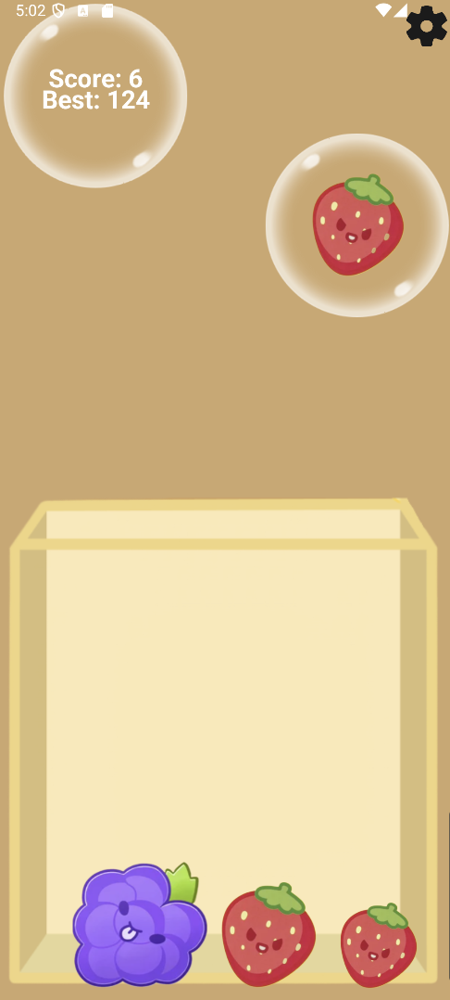
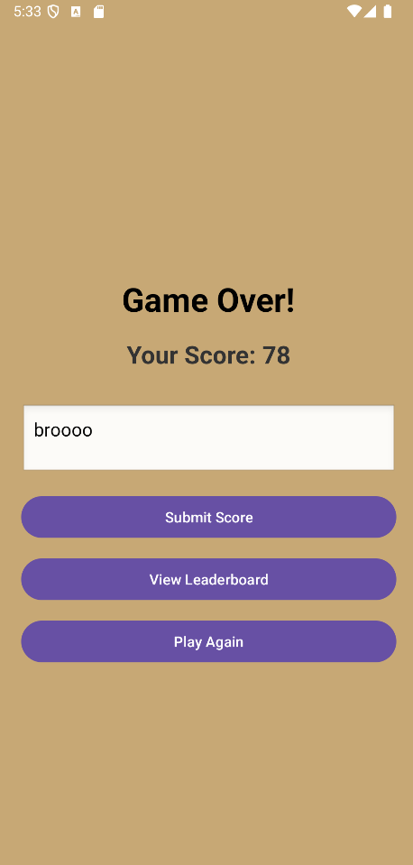
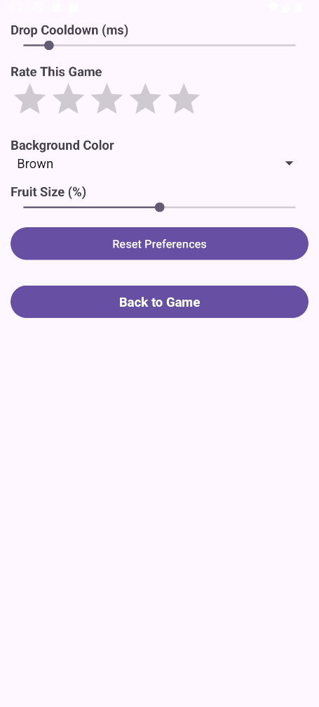

# 🍓 Suika Game Clone (Android)

A clone of the classic Suika (Watermelon) Game built with Android native tools! Stack fruits, score high, and challenge your friends.

---

## 🎮 Gameplay

Drag and drop fruits into a box. When two of the same fruit collide, they combine into a larger one! Be strategic—don’t let the box overflow!

---

## ✨ Features

- 🍇 **Physics-based Collision System** using native Android game loop logic
- 🌐 **Firebase Connectivity** to submit and fetch leaderboard scores
- 📱 **SharedPreferences** to save player settings (background color, fruit size, cooldown, etc.)
- 📊 **Custom Leaderboard** and high-score tracking
- 🎨 **Game Settings Menu** with:
  - Drop Cooldown control
  - Star rating
  - Background color picker
  - Fruit size slider
- 📢 **Ad Integration** to display ads (for monetization)
- 🏆 **Game Over Screen** with score submission and replay options

---

## 🖼 Screenshots

| Gameplay | Game Over | Settings |
|---------|------------|-----------|
| |  |  |

---

## 🔧 Build & Run

1. Clone the repo:
   ```bash
   git clone https://github.com/your-username/suika-game-clone.git
